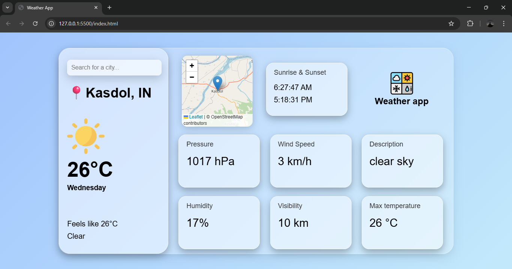

# 🌦️ Weather App

A simple weather application that allows users to check real-time weather conditions for any city using **OpenWeather API**.

---

## 🚀 Features
- 🔍 Search weather by city name  
- 🌡️ Displays temperature, humidity, and wind speed  
- 🌥️ Shows weather condition icons  
- ⚡ Real-time data fetching via API  

---

## 🛠️ Tech Stack
| Technology | Purpose |
|------------|----------|
| HTML / CSS | UI & Styling |
| JavaScript | API fetching & DOM updates |
| OpenWeather API | Real-time weather data |

---

## 🌐 Live Demo
👉 https://bhevesh31.github.io/Weather-app/

---

## 📸 Screenshot
> Interface of the app

---

