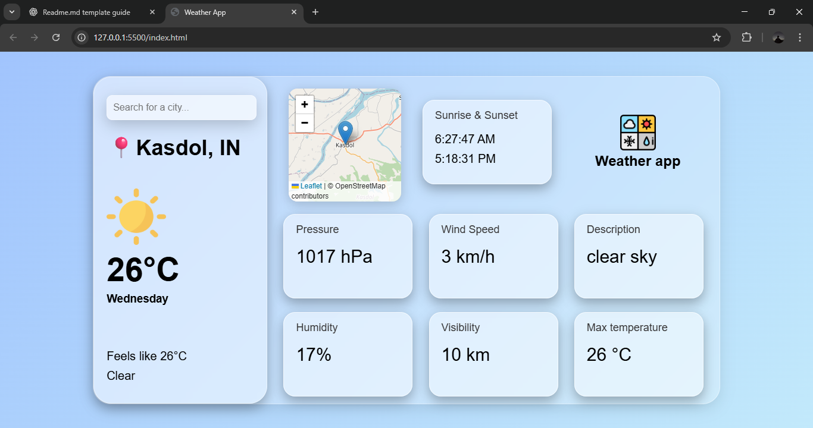

## A simple weather application that allows users to check real-time weather conditions for any city using OpenWeather API

## Features:
### ->Search weather by city name
### -> Displays temperature,humidity, wind speed
### -> Shows weather condition icons
### -> Real-time fetching via API

## Tech Stack:
### Html/CSS --> UI & Styling
### JavaScript --> fetching API & DOM updates
### Weather API --> Real time weather data

## Live app 
https://bhevesh31.github.io/Weather-app/

## 📸 Screenshot:

